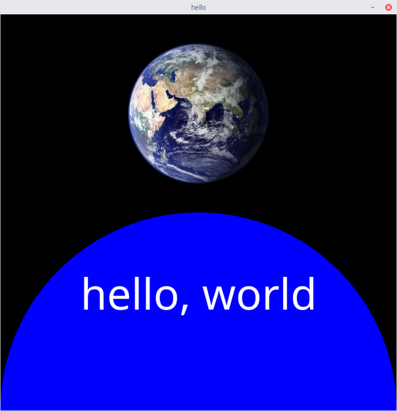

# fc - high-level canvas for the fyne toolkit



is created with:

```
package main

import (
	"image/color"

	"github.com/ajstarks/fc"
)

func main() {
	width := 500
	height := 500
	blue := color.RGBA{0, 0, 255, 255}
	white := color.RGBA{255, 255, 255, 255}

	canvas := fc.NewCanvas("hello", width, height)

	canvas.Circle(50, 0, 100, blue)
	canvas.CText(50, 25, 10, "hello, world", white)
	canvas.Image(50, 75, 200, 200, "earth.jpg")

	canvas.EndRun()
}
```

## Introduction

There are methods for Text (begin, centered, and end aligned), Circles, Lines, Rectangles, and Images.

## Percent coordinate based methods

### NewCanvas makes a new canvas
	NewCanvas(name string, w, h int) Canvas

### EndRun shows the content and runs the app
	(canvas *Canvas) EndRun()

### Text places text within a container, using percent coordinates
	(canvas *Canvas) Text(x, y float64, size float64, s string, color color.RGBA) {


### CText places centered text using percent coordinates
	(canvas *Canvas) CText(x, y float64, size float64, s string, color color.RGBA) {
	

### EText places end-aligned text within a container, using percent coordinates
	(canvas *Canvas) EText(x, y float64, size float64, s string, color color.RGBA) {
	

### Circle places a circle within a container, using percent coordinates
	(canvas *Canvas) Circle(x, y, r float64, color color.RGBA) {
	

### Line places a line within a container, using percent coordinates
	(canvas *Canvas) Line(x1, y1, x2, y2, size float64, color color.RGBA) {
	

### Rect places a rectangle centered on (x,y) within a container, using percent coordinates
	(canvas *Canvas) Rect(x, y, w, h float64, color color.RGBA) {
	

### CornerRect places a rectangle with upper left corner  on (x,y) within a container, using percent coordinates
	(canvas *Canvas) CornerRect(x, y, w, h float64, color color.RGBA) {
	
### Image places an image centered at (x, y) within a container, using percent coordinates
	(canvas *Canvas) Image(x, y float64, w, h int, name string) {
	

## Absolute methods: uses absolute coordinate system and fyne structures directly

### AbsStart -- begin the application

	func AbsStart(name string, w, h int) (fyne.Window, *fyne.Container)


### AbsEndRun -- run the app

	func AbsEnd(window fyne.Window, content *fyne.Container, w, h int) {

### AbsText -- Add text at (x,y) with the specified size and color

	func AbsText(c *fyne.Container, x, y int, s string, size int, color color.RGBA)

### AbsTextMid -- Add Center text

	func AbsTextMid(c *fyne.Container, x, y int, s string, size int, color color.RGBA)

### AbsTectEnd -- Add End-Aligned text

	func AbsTextEnd(c *fyne.Container, x, y int, s string, size int, color color.RGBA)

### AbsLine -- Add  a colored line from (x1,y1) to (x2, y2)

	func AbsLine(c *fyne.Container, x1, y1, x2, y2 int, size float32, color color.RGBA)

### AbsCircle --- Add a circle object centered at (x,y) with radius r

	func AbsCircle(c *fyne.Container, x, y, r int, color color.RGBA)

### AbsCornerRect -- Add a rectangle with (c *fyne.Container, x,y) at the upper left, with dimension (w, h)

	func AbsCornerRect(c *fyne.Container, x, y, w, h int, color color.RGBA)

### AbsRect -- Add a rectangle centered at (c *fyne.Container, x,y), with dimension (w, h)

	func AbsRect(c *fyne.Container, x, y, w, h int, color color.RGBA)

### AbsAdd an image named as name centered at (x, y) with dimensions ( w, h)

	func AbsImage(c *fyne.Container, x, y, w, h int, name string)

### AbsAdd an named image with upper left at (x, y) with dimensions (w, h)

	func AbsCornerImage(c *fyne.Container, x, y, w, h int, name string)
