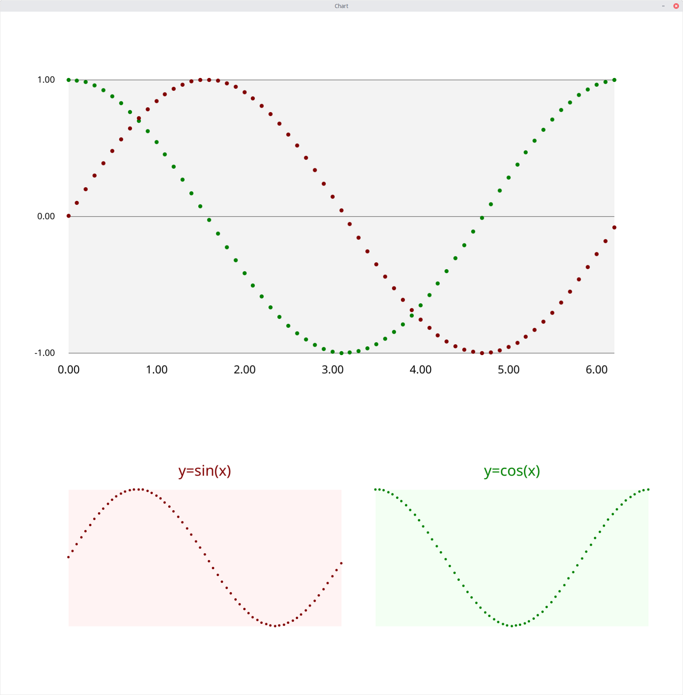

# chart -- chart package using the fync canvas library

The chart library works by reading data into a ```ChartBox``` structure, and then composing elements as needed.
Elements (chart types: linechart, bar, column, scatter, attributes: axes, titles, and frames) are arranged
within a scalable area defined by a top, bottom, left, right.



```
	chart, err := DataRead(os.Stdin)
	if err != nil {
		return err
	}
	red := color.RGBA{127, 0, 0, 255}
	black := color.RGBA{0, 0, 0, 255}

	textsize := 1.2
	chart.top = 90
	chart.left = 15
	chart.bottom = 70

	chart.Title(canvas, 2, 2)
	chart.Frame(canvas, 5)
	chart.YAxis(canvas, textsize, 0, 800000, 100000, "%0.f", false)
	chart.Label(canvas, textsize, 5)
	chart.color = black
	chart.Scatter(canvas, 0.5)
	chart.color = red
	chart.Line(canvas, 0.1)
	chart.Bar(canvas, 0.25)

```